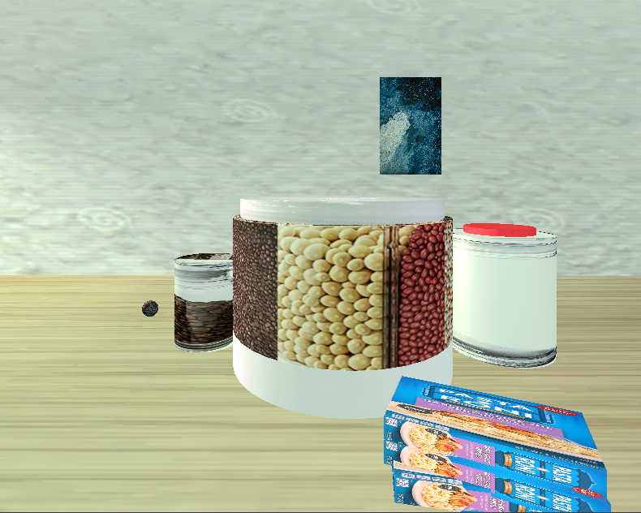
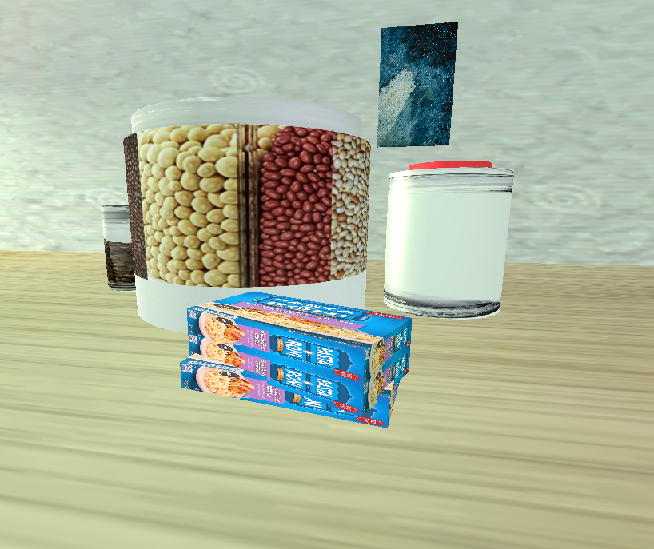

# CS330-Comp-Graphic-and-Visualization Final Project

# Junyu Liang

# Welcome to the project repository for my CS 330 Computer Graphics and Visualization course at SNHU Online!

This course focused on 3D object creation using OpenGL with C++, emphasizing transformations, camera control, and scene construction. While the base code was adapted from tutorial materials, I implemented significant improvements to the architecture:

✅ Refactored the URender method to streamline shape rendering.

✅ Designed and implemented ShapeBuilder and SceneBuilder classes entirely from scratch, creating a modular, extensible framework for scene generation.

✅ Developed a user-friendly final project that allows anyone to generate basic 3D scenes with minimal setup.

Browse through the source code and explore the different assignments and projects developed throughout the course. The Final Project folder contains the culmination of my learning, including full documentation and a project summary report.

---------------------------------------------------------------------------------------------------------------------------

# Final project: Replicate a 2D image into a 3D scene. 

Below are some screenshots from my project:

