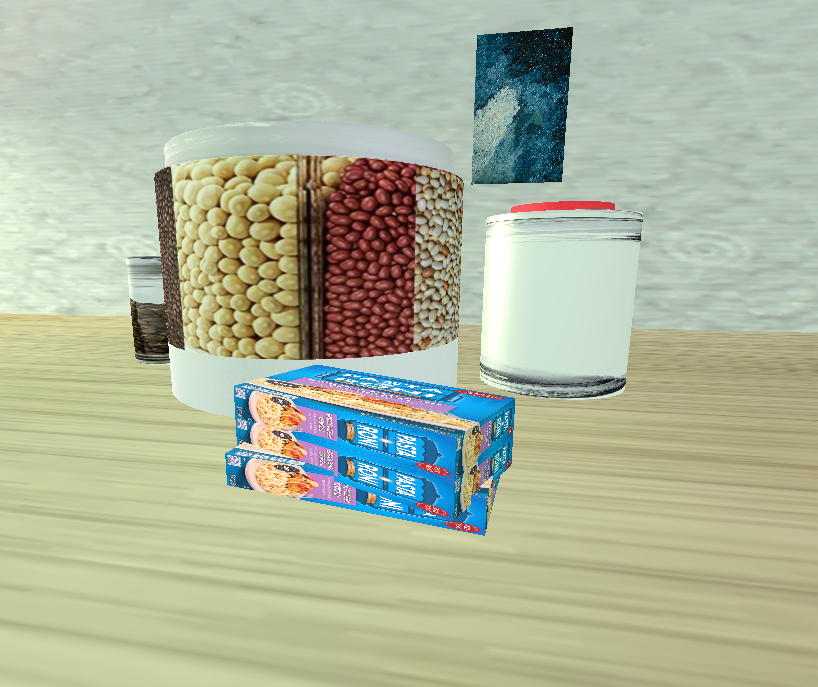

# CS330-Comp-Graphic-and-Visualization Final Project

# Junyu Liang

# Welcome to the project repository for my CS 330 Computer Graphics and Visualization course at SNHU Online!

This course focused on 3D object creation using OpenGL with C++, emphasizing transformations, camera control, and scene construction. While the base code was adapted from tutorial materials, I implemented significant improvements to the architecture:

✅ Refactored the URender method to streamline shape rendering.

✅ Designed and implemented ShapeBuilder and SceneBuilder classes entirely from scratch, creating a modular, extensible framework for scene generation.

✅ Developed a user-friendly final project that allows anyone to generate basic 3D scenes with minimal setup.

Browse through the source code and explore the different assignments and projects developed throughout the course. The Final Project folder contains the culmination of my learning, including full documentation and a project summary report.

---------------------------------------------------------------------------------------------------------------------------

# Final project: Replicate a 2D image into a 3D scene. 

Below is a screenshot from my project:

----------------------------------------------------------------------------------------------------------------------------
# How do I approach designing software?

How do I approach designing software?
This project taught me the importance of planning software structure from the ground up. I focused on organizing the code by defining clear responsibilities across different classes—for example, separating the paddle, ball, and brick logic into their own files. This modularity made my design cleaner and easier to maintain. It also allowed me to reuse and tweak components without introducing bugs elsewhere in the system. The design process I followed was iterative: I began with a working prototype, then refined both logic and visuals in stages. I frequently paused to review what I’d built, test edge cases, and ask whether new features fit into the architecture without overcomplicating it. These tactics—starting small, breaking down systems, and refactoring often—are highly transferable to any future software project I take on.

How do I approach developing programs?
My development strategy has evolved a lot thanks to this project. I implemented new strategies like clamping values to constrain paddle movement and launching the ball on a single tap, which helped make the game feel smoother and more responsive. I also adopted a test-and-adjust mindset. Each new feature was built in isolation first, tested, and then integrated. This iterative approach allowed me to catch bugs early and balance gameplay mechanics more effectively. Over the course of the milestones, I also grew more comfortable with debugging OpenGL behaviors and using vector math to simulate realistic physics. All of this has helped me move from "just getting things to work" to writing code that is intentional, clean, and scalable.

How can computer science help me in reaching my goals?
One of the biggest takeaways from this project is how powerful computational graphics can be. Learning how to visualize physics-based interactions and control user input in a dynamic visual scene gave me new tools that I can use in future education—particularly in UI/UX development, simulations, or game engines. Professionally, these skills also open doors in fields like interactive product design, data visualization, and software prototyping. More broadly, this project reminded me that code is more than logic—it’s also about user experience, visual storytelling, and system performance. Those are the kinds of skills I’ll need no matter where my future in computer science takes me.

